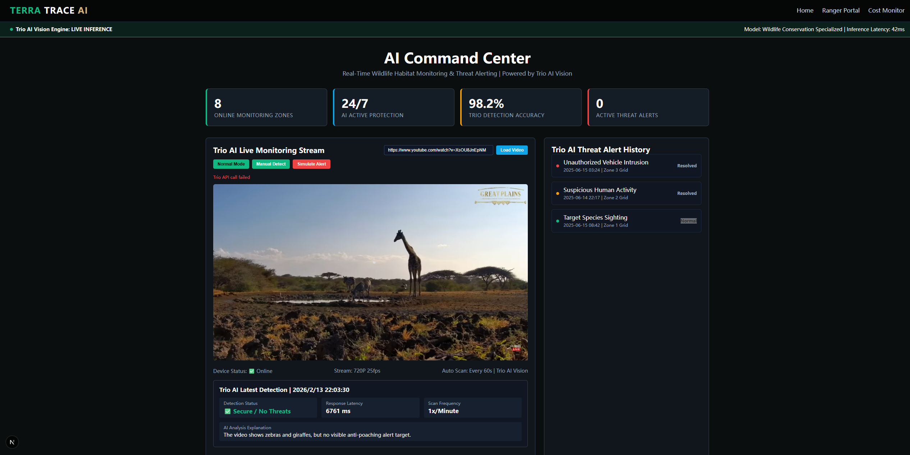

# TerraTrace AI Command Center
  
*Screenshot of the TerraTrace AI Command Center - Real-time wildlife anti-poaching monitoring powered by Trio AI Vision.*

## Project Overview
A lightweight, single-page Next.js application focused on **wildlife anti-poaching monitoring** and real-time threat alerting. This project leverages Trio AI Vision's powerful object detection capabilities to analyze live wildlife reserve video streams, identify protected species and poaching threats, and trigger instant alerts—all from a single, intuitive command center interface.

Designed for simplicity and production readiness, the application only includes the core `command-center` page (no redundant routes) and uses environment variables to securely configure Trio AI credentials and detection prompts.

## Key Features
- **Trio AI Vision Integration**: Real-time video frame analysis to detect protected species (e.g., African Elephants) and poaching threats (unauthorized vehicles, humans, hunting tools).
- **Single-Page Focus**: No extra routes—directly access the command center at the root URL.
- **Real-Time Alerts**: Automatic alert triggering when high-risk threats are detected, with visual indicators and historical alert logs.
- **Environment Variable Configuration**: Securely manage Trio AI API keys, detection prompts, and endpoints via a single `.env.local` file.
- **Responsive Design**: Fully adaptive layout for desktop and large-screen monitoring stations.
- **Habitat Health Metrics**: Visualize reserve health scores (vegetation coverage, water source health) analyzed by Trio AI remote sensing.
- **Type-Safe Code**: Full TypeScript support for reliable Trio AI API integration and type checking.

## Prerequisites
- Node.js (v18.17.0 - v20.x)
- npm/pnpm/yarn
- A Trio AI account with:
  - `TRIO_API_KEY` (Trio platform API secret key)
  - `TRIO_VISION_ENDPOINT` (Trio AI Vision inference API URL)
- Git

## Installation & Getting Started
1. **Clone the Repository**
   ```bash
   git clone https://github.com/iloveyou-github/terratrace-ai-command-center.git
   cd terratrace-ai-command-center
   ```

2. **Install Dependencies**
   ```bash
   # Using pnpm (recommended)
   pnpm install

   # Or npm
   npm install

   # Or yarn
   yarn install
   ```

3. **Configure Environment Variables**
   Create a `.env.local` file in the root directory and add your Trio AI configuration (replace placeholders with your actual values):
   ```env
   # Trio AI Configuration (Server-Side Only - Never Exposed to Browser)
   TRIO_API_KEY=your-trio-api-secret-key
   TRIO_VISION_ENDPOINT=https://api.trio.ai/v1/vision/inference

   # Client-Side Detection Prompt (Editable Without Code Changes)
   NEXT_PUBLIC_TRIO_DETECT_PROMPT=Is any poaching threat visible in this wildlife monitoring frame?
   ```

4. **Run the Development Server**
   ```bash
   # Using pnpm
   pnpm dev

   # Or npm
   npm run dev

   # Or yarn
   yarn dev
   ```

5. **Access the Command Center**
   Open your browser and navigate to `http://localhost:3000`—you’ll be directly taken to the AI Command Center (no extra routes or pages).

## Environment Variables
All configuration is managed via the `.env.local` file (never commit this file to version control!). Below is a breakdown of each required variable:

| Variable Name                  | Description                                                                 | Type       |
|--------------------------------|-----------------------------------------------------------------------------|------------|
| `TRIO_API_KEY`                 | Your Trio AI platform secret API key (server-side only, never exposed).    | Required   |
| `TRIO_VISION_ENDPOINT`         | Full URL of the Trio AI Vision inference API endpoint.                     | Required   |
| `NEXT_PUBLIC_TRIO_DETECT_PROMPT` | Custom prompt for Trio AI detection (used for video frame analysis).       | Required   |

## Tech Stack
- **Framework**: Next.js 16.1.6 (App Router)
- **Frontend**: React 18.3.1, TypeScript 5.4.5
- **AI Integration**: Trio AI Vision API (object detection, real-time inference)
- **Styling**: Inline CSS + Global Responsive Styles (no external CSS libraries)
- **Deployment**: Vercel (recommended) / GitHub Pages / Any Node.js hosting

## Usage
### 1. Add YouTube Live Stream URL
To use your own wildlife reserve video stream:
Enter your YouTube live stream URL into the input box labeled Paste YouTube video URL here.
Example valid URL: https://www.youtube.com/watch?v=XsOU8JnEpNM

### 2. Modify the Trio AI Detection Prompt
No code changes needed! Simply update the `NEXT_PUBLIC_TRIO_DETECT_PROMPT` value in `.env.local`—the page will automatically reflect the new prompt.

### 3. Simulate Threat Alerts
Use the "Simulate Threat Alert" button in the command center to test the alert system (triggers a mock unauthorized vehicle detection and visual warning).

### 4. View Trio AI Detection Results
The application automatically extracts video frames every 2 seconds, sends them to the Trio AI Vision API, and renders detection boxes (green for protected species, red for threats) directly on the video stream.

## Notes
- **Screenshot Replacement**: Replace `screenshots/command-center.png` with a screenshot of your own command center interface before pushing to GitHub.
- **Trio AI API Compatibility**: Ensure your Trio AI model is fine-tuned for wildlife/anti-poaching detection (supports classes like "African Elephant", "Unauthorized Vehicle", "Poacher").
- **Production Deployment**: For production, deploy to Vercel (optimal for Next.js) and add your environment variables in the Vercel dashboard (Settings → Environment Variables).
- **Error Handling**: The application includes basic error handling for Trio AI API failures—check the browser console for detailed logs if detections aren’t working.

## License
MIT License

Copyright (c) 2024 [ZhangJianian/IoTeX]

Permission is hereby granted, free of charge, to any person obtaining a copy of this software and associated documentation files (the "Software"), to deal in the Software without restriction, including without limitation the rights to use, copy, modify, merge, publish, distribute, sublicense, and/or sell copies of the Software, subject to the following conditions:

The above copyright notice and this permission notice shall be included in all copies or substantial portions of the Software.

THE SOFTWARE IS PROVIDED "AS IS", WITHOUT WARRANTY OF ANY KIND, EXPRESS OR IMPLIED, INCLUDING BUT NOT LIMITED TO THE WARRANTIES OF MERCHANTABILITY, FITNESS FOR A PARTICULAR PURPOSE AND NONINFRINGEMENT. IN NO EVENT SHALL THE AUTHORS OR COPYRIGHT HOLDERS BE LIABLE FOR ANY CLAIM, DAMAGES OR OTHER LIABILITY, WHETHER IN AN ACTION OF CONTRACT, TORT OR OTHERWISE, ARISING FROM, OUT OF OR IN CONNECTION WITH THE SOFTWARE OR THE USE OR OTHER DEALINGS IN THE SOFTWARE.
